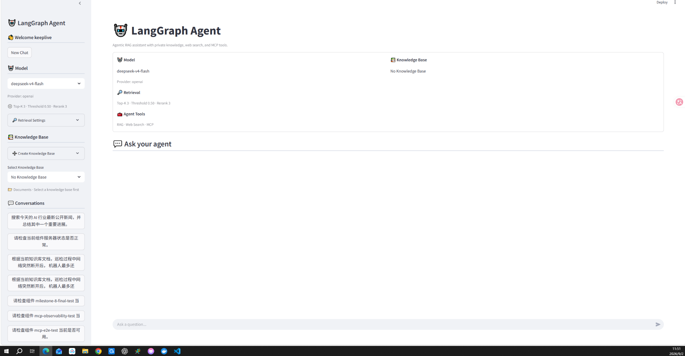
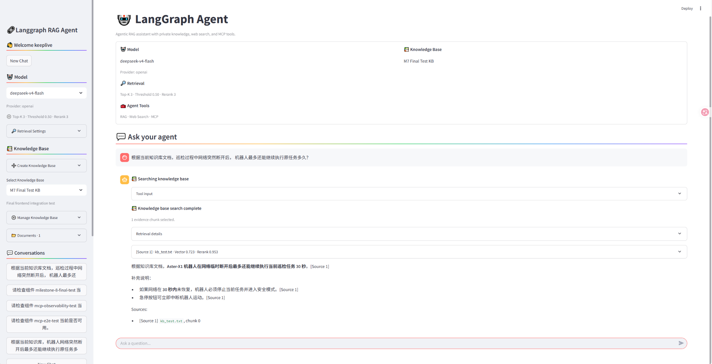
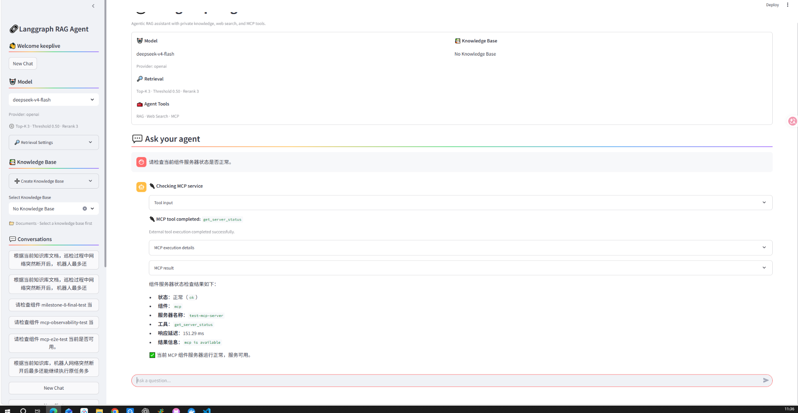
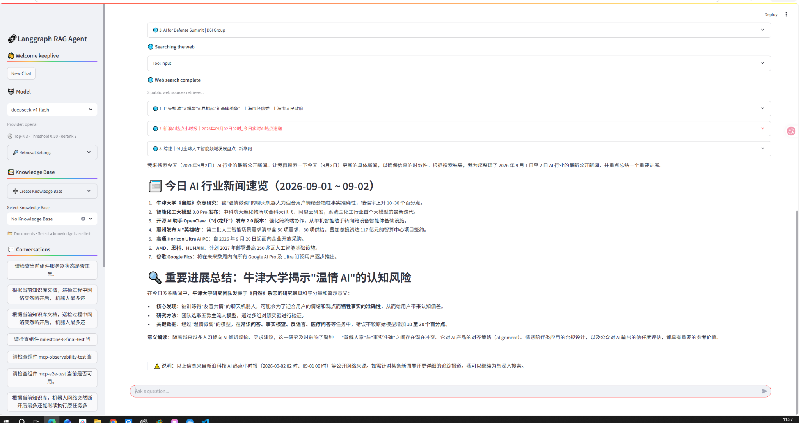
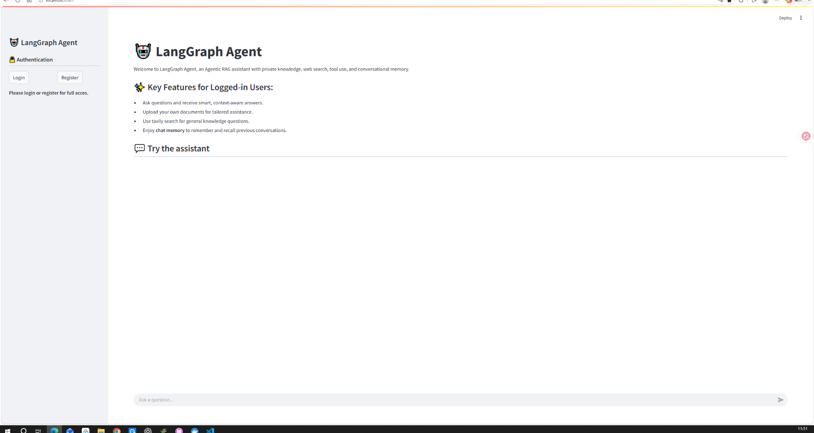

# 🤖 LangGraph Agentic RAG Platform

An engineering-oriented **Agentic RAG system** built with **FastAPI, LangGraph, PostgreSQL/pgvector, MCP, and Streamlit**.

The platform combines private knowledge retrieval, web search, MCP tools, persistent conversation memory, retrieval quality control, and agent evaluation into a unified AI application stack.

It is designed not only to make an Agent work, but also to make its **retrieval, tool routing, evidence quality, failures, and execution process observable and evaluable**.

## ✨ Highlights

- **Agentic RAG**
  LangGraph ReAct Agent dynamically routes requests between private knowledge retrieval, web search, MCP tools, and direct model responses.

- **Multi-Knowledge-Base Management**
  Users can create independent knowledge bases, upload PDF/DOCX/TXT documents, bind conversations to a knowledge base, and manage indexed documents.

- **Retrieval Quality Pipeline**
  Semantic retrieval is enhanced with configurable Top-K, similarity threshold filtering, reranking, and an evidence gate to reduce low-confidence answers.

- **Citation & Retrieval Observability**
  Retrieval results expose source metadata, similarity scores, rerank scores, candidate counts, filtering results, and final evidence used by the Agent.

- **MCP Tool Ecosystem**
  Native LangChain tools and MCP tools are integrated through a unified tool registry, allowing the Agent to dynamically discover and invoke external capabilities.

- **Agent Evaluation & Reliability**
  Includes deterministic and real-model evaluation for tool routing, argument generation, no-tool decisions, and controlled tool failure scenarios.

- **Productized Agent UI**
  Streamlit interface provides model configuration, knowledge base management, retrieval controls, conversation management, and structured RAG/Web/MCP execution cards.

- **Persistent Memory & Authentication**
  JWT-based user authentication, isolated user resources, threaded conversations, and LangGraph PostgreSQL checkpointer persistence.

- **Dockerized Full Stack**
  FastAPI backend, Streamlit frontend, and PostgreSQL/pgvector are orchestrated through Docker Compose with health checks and service dependencies.

## 🎯 System Capabilities

```text
User Query
    │
    ▼
LangGraph ReAct Agent
    │
    ├── Direct LLM Response
    │
    ├── Private Knowledge Retrieval
    │      └── Vector Search
    │          → Similarity Threshold
    │          → Reranker
    │          → Evidence Gate
    │          → Citation
    │
    ├── Web Search
    │
    └── MCP Tools
           └── Unified Tool Registry

PostgreSQL / pgvector
    ├── Users
    ├── Threads
    ├── Knowledge Bases
    ├── Documents
    ├── Vector Embeddings
    └── LangGraph Checkpoints

```
## 💻 Tech Stack

| Layer | Technologies |
| --- | --- |
| Agent | LangGraph, LangChain, ReAct, Tool Calling |
| Backend | FastAPI, Python, Pydantic v2, SQLAlchemy 2.0 |
| RAG | Embeddings, pgvector, Similarity Threshold, Reranker, Evidence Gate |
| Tool Ecosystem | Native LangChain Tools, Tavily Web Search, MCP |
| Database | PostgreSQL, pgvector |
| Memory | LangGraph PostgreSQL Checkpointer |
| Frontend | Streamlit |
| Authentication | JWT |
| Evaluation | Agent Routing Evaluation, Failure Reliability Evaluation |
| Deployment | Docker, Docker Compose |

## 📋 Prerequisites

- Python 3.12+
- Docker and Docker Compose (recommended for Postgres + full stack)

## 🚀 Quick Start

### 1. Clone the repository

```bash
git clone https://github.com/721keep/LangGraph-RAG-Agent.git
cd LangGraph-RAG-Agent
git checkout dev
```

### 2. Configure environment variables

Copy the environment template:

```bash
cp env.example .env
```

For Windows PowerShell:

```powershell
Copy-Item env.example .env
```

Then configure the required API keys, model settings, and database credentials in `.env`.

### 3. Start the full stack

```bash
docker compose up --build
```

Or run the services in the background:

```bash
docker compose up -d --build
```

### 4. Access the application

| Service | Address |
| --- | --- |
| Streamlit UI | `http://localhost:8501` |
| FastAPI Backend | `http://localhost:8000/api/v1` |
| Swagger UI | `http://localhost:8000/api/v1/docs` |
| ReDoc | `http://localhost:8000/api/v1/redoc` |

The Docker Compose stack starts:

- PostgreSQL with pgvector
- FastAPI backend
- Streamlit frontend

## 🧰 Local Development

### 1) Backend (FastAPI)

```bash
cd backend
python -m venv .venv
.venv/Scripts/activate     # Windows
# source .venv/bin/activate  # Linux/macOS
pip install -r requirements.txt
```

Ensure a Postgres instance is running with pgvector. Example (Docker):
```bash
docker run --name langgraph_postgres -p 5432:5432 \
  -e POSTGRES_USER=postgres -e POSTGRES_PASSWORD=test -e POSTGRES_DB=langgraph_db \
  -d pgvector/pgvector:pg16
```

Run the API:
```bash
uvicorn app.main:app --reload --host 0.0.0.0 --port 8000 --reload-dir ./app
```

### 2) Frontend (Streamlit)

```bash
cd frontend
python -m venv .venv
.venv/Scripts/activate     # Windows
# source .venv/bin/activate  # Linux/macOS
pip install -r requirements.txt
streamlit run gui/main.py
```

## 🔧 Environment Variables

Configuration is loaded from the project-root `.env` file.

Start from the provided template:

```bash
cp env.example .env
```

For Windows PowerShell:

```powershell
Copy-Item env.example .env
```

### Model & Tool Configuration

| Variable | Purpose |
| --- | --- |
| `CHAT_API_KEY` | API key used by the configured chat model |
| `MODEL_PROVIDER` | LangChain model provider |
| `MODEL_NAMES` | Available chat model list |
| `MODEL_BASE_URL` | Optional OpenAI-compatible chat model endpoint |
| `DASHSCOPE_API_KEY` | API key used by embeddings and reranker services |
| `EMBEDDINGS_MODEL_NAME` | Embedding model used for indexing and retrieval |
| `EMBEDDINGS_BASE_URL` | Optional embedding service endpoint |
| `TAVILY_API_KEY` | API key used by the web search tool |
| `APP_TIMEZONE` | Application timezone |

### Authentication

| Variable | Purpose |
| --- | --- |
| `TOKEN_BEARER_URL` | Authentication token endpoint |
| `JWT_SECRET` | Secret used to sign JWT tokens |
| `JWT_ALGORITHM` | JWT signing algorithm |
| `ACCESS_TOKEN_EXPIRY_MINS` | Access token expiration time |
| `REFRESH_TOKEN_EXPIRY_DAYS` | Refresh token expiration time |

### PostgreSQL / pgvector

| Variable | Purpose |
| --- | --- |
| `POSTGRES_HOST` | PostgreSQL host |
| `POSTGRES_PORT` | PostgreSQL port |
| `POSTGRES_USER` | PostgreSQL username |
| `POSTGRES_PASSWORD` | PostgreSQL password |
| `POSTGRES_DATABASE` | Application database name |
| `PGVECTOR_COLLECTION_NAME` | pgvector collection used by the RAG pipeline |

### Frontend

| Variable | Purpose |
| --- | --- |
| `BACKEND_BASE_URL` | FastAPI base URL used by the Streamlit frontend |

See `env.example` for the complete configuration template.

> Do not commit real API keys, passwords, or JWT secrets to the repository.

## 🧩 API Overview

All backend APIs are exposed under:

```text
/api/v1
```

Interactive API documentation is available at:

```text
http://localhost:8000/api/v1/docs
```

### Authentication

| Method | Endpoint | Description |
| --- | --- | --- |
| `POST` | `/auth/signup` | Create a user account |
| `POST` | `/auth/login` | Login and obtain access / refresh tokens |
| `GET` | `/auth/logout` | Logout the current user |
| `GET` | `/auth/refresh-token` | Generate a new access token |

### Users

| Method | Endpoint | Description |
| --- | --- | --- |
| `GET` | `/users/me` | Get the current user |
| `PUT` | `/users/user-profile/{user_id}` | Update a user profile |
| `DELETE` | `/users/user-profile/{user_id}` | Delete a user profile |

### Threads

| Method | Endpoint | Description |
| --- | --- | --- |
| `POST` | `/threads/` | Create a conversation thread |
| `GET` | `/threads/` | List the current user's threads |
| `GET` | `/threads/{thread_id}` | Get a thread |
| `PATCH` | `/threads/{thread_id}` | Update a thread |
| `PATCH` | `/threads/{thread_id}/knowledge-base` | Bind, switch, or unbind a knowledge base |
| `DELETE` | `/threads/{thread_id}` | Delete a thread |

### Knowledge Bases

| Method | Endpoint | Description |
| --- | --- | --- |
| `POST` | `/knowledge-bases/` | Create a knowledge base |
| `GET` | `/knowledge-bases/` | List the current user's knowledge bases |
| `GET` | `/knowledge-bases/{knowledge_base_id}` | Get a knowledge base |
| `PATCH` | `/knowledge-bases/{knowledge_base_id}` | Update a knowledge base |
| `DELETE` | `/knowledge-bases/{knowledge_base_id}` | Delete a knowledge base |

### Documents

| Method | Endpoint | Description |
| --- | --- | --- |
| `GET` | `/documents/{thread_id}` | List documents associated with a legacy thread scope |
| `POST` | `/documents/upload/{thread_id}` | Upload and index a document into a legacy thread scope |
| `GET` | `/documents/knowledge-bases/{knowledge_base_id}` | List documents in a knowledge base |
| `POST` | `/documents/knowledge-bases/{knowledge_base_id}/upload` | Upload and index a document into a knowledge base |
| `DELETE` | `/documents/{document_id}` | Delete a document and its vector chunks |

Supported document formats:

```text
PDF · DOCX · TXT
```

### Chat

| Method | Endpoint | Description |
| --- | --- | --- |
| `POST` | `/chat/` | Start a streaming chat request |
| `GET` | `/chat/config` | Get available model configuration |
| `POST` | `/chat/{thread_id}` | Run an authenticated Agent conversation |
| `GET` | `/chat/{thread_id}` | Retrieve persisted chat history |

## 📡 Streaming Protocol

The authenticated chat endpoint streams newline-delimited JSON events so the frontend can render the Agent execution process in real time.

### Event Types

#### LLM Output

```json
{
  "type": "llm_chunk",
  "content": "Generated response..."
}
```

#### Tool Call

```json
{
  "type": "tool_call",
  "name": "retrieve_user_documents",
  "args": {
    "query": "project architecture"
  }
}
```

#### Tool Result

```json
{
  "type": "tool_result",
  "name": "retrieve_user_documents",
  "content": "..."
}
```

MCP tool results may additionally include structured execution metadata:

```json
{
  "type": "tool_result",
  "name": "get_server_status",
  "tool_source": "mcp",
  "server_name": "test-mcp-server",
  "status": "success",
  "success": true,
  "latency_ms": 12,
  "error_reason": null,
  "content": "..."
}
```

The Streamlit frontend consumes these events and renders user-facing execution cards for:

- Agent tool calls
- Knowledge base retrieval
- Web search
- MCP tool execution
- Retrieval evidence and scores
- Tool and retrieval failures

## 🏗️ Architecture

The system is organized around a LangGraph ReAct Agent. The Agent selects the appropriate execution path according to the user request while the backend provides persistence, retrieval, tool integration, and streaming.

```text
┌─────────────────────────────────────────────┐
│                Streamlit UI                 │
│                                             │
│ Model / Knowledge Base / Retrieval Config   │
│ Conversation / Tool & Evidence Cards        │
└──────────────────────┬──────────────────────┘
                       │
                       ▼
┌─────────────────────────────────────────────┐
│                 FastAPI API                 │
│                                             │
│ Auth / Threads / Knowledge Bases / Docs     │
│ Chat Streaming / Configuration              │
└──────────────────────┬──────────────────────┘
                       │
                       ▼
┌─────────────────────────────────────────────┐
│             LangGraph ReAct Agent           │
│                                             │
│     Reasoning · Routing · Tool Calling       │
└─────────────┬────────────┬────────────┬──────┘
              │            │            │
              ▼            ▼            ▼
       ┌────────────┐ ┌──────────┐ ┌──────────┐
       │ RAG Tool   │ │Web Search│ │ MCP Tool │
       └─────┬──────┘ └──────────┘ └──────────┘
             │
             ▼
       Vector Search
             │
             ▼
    Similarity Threshold
             │
             ▼
          Reranker
             │
             ▼
        Evidence Gate
             │
             ▼
      Evidence + Citation

              │
              ▼
┌─────────────────────────────────────────────┐
│           PostgreSQL + pgvector             │
│                                             │
│ Users / Threads / Knowledge Bases / Docs    │
│ Embeddings / LangGraph Checkpoints          │
└─────────────────────────────────────────────┘
```
## 📊 Evaluation Results

The project includes an evaluation framework for both Agent routing quality and tool failure reliability.

### Agent Routing Evaluation

The real-model routing evaluation covers four routing categories:

- Private knowledge retrieval
- Web search
- MCP tool execution
- No-tool direct response

Current evaluation results:

| Metric | Result |
| --- | ---: |
| Total Cases | 8 |
| Tool Selection Accuracy | 100% |
| Wrong Tool Rate | 0% |
| No-Tool Accuracy | 100% |
| Argument Accuracy | 100% |

Per-tool routing accuracy:

| Route | Correct / Total | Accuracy |
| --- | ---: | ---: |
| Knowledge Retrieval | 2 / 2 | 100% |
| Web Search | 2 / 2 | 100% |
| MCP Tool | 2 / 2 | 100% |
| No Tool | 2 / 2 | 100% |

### Failure Reliability Evaluation

Controlled failure tests verify that MCP tool failures are converted into structured and observable Agent errors.

| Failure Scenario | Result |
| --- | --- |
| Tool Execution Error | PASS |
| Invalid Arguments | PASS |
| Tool Timeout | PASS |
| MCP Server Unavailable | PASS |

**Failure Handling Pass Rate: 100% (4 / 4)**

Evaluation reports are stored under:

```text
backend/evaluation/reports/
```

Representative reports:

```text
agent_routing_deepseek-v4-flash.json
agent_routing_deepseek-v4-flash.csv
agent_failure_reliability.json
agent_failure_reliability.csv
```

## 🖼️ Screenshots

### Agent Workspace

The authenticated workspace exposes the active model, knowledge base, retrieval configuration, available Agent tools, and conversation history.



### RAG Retrieval & Evidence

Knowledge base retrieval exposes selected evidence together with retrieval metadata, rerank scores, and citation information.



### MCP Tool Execution

MCP tool calls are rendered as structured execution cards with tool status, server information, latency, and execution details.



### Web Search

Web search results are presented as structured source cards instead of raw tool output.



### Unauthenticated Home

The public landing page provides authentication entry points and a concise overview of the Agent platform.



## 📝 License

Licensed under the [MIT License](./LICENSE).

## 🤝 Contributing

Contributions are welcome! Please open an issue or submit a PR.


